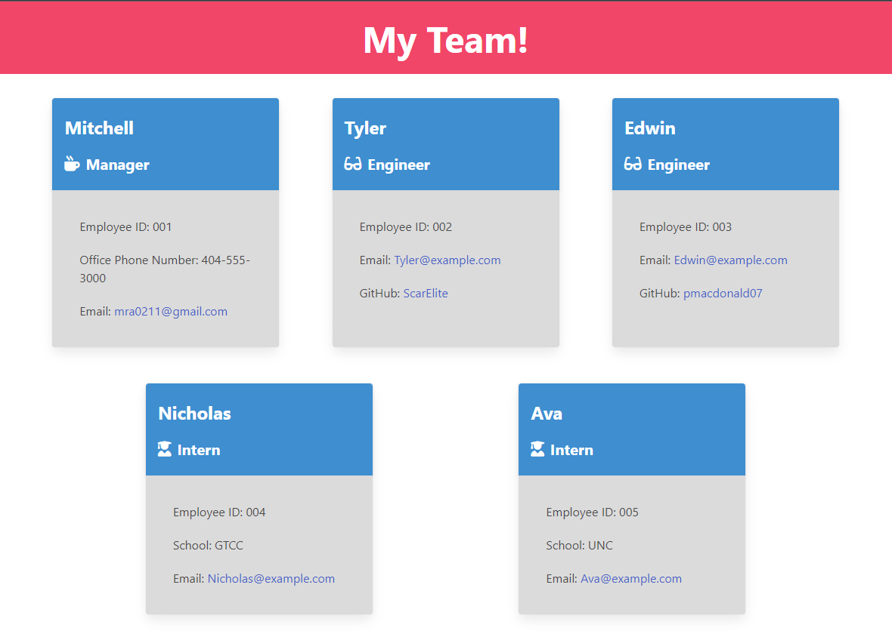

# Team Profile Generator

## About the Project

This application was created to provide you with an easy way to build your team and define their roles as well as provide some info about them. Simply run node index.js in the command line and answer all of the questions that you are prompted with. You will be asked to fill out some info for your manager, engineer(s), and intern(s). Once you fill out all of the necessary information an index.html will be generated with each member of your team and their info displayed inside of a card. There will also be links that you can click on to go straight to your engineer's github profile and/or send an email to anyone on the team by clicking on their email address.

## Built With:

- JavaScript
- Node.js
- Inquirer
- HTML (Template Literal)
- Bulma CSS

## Installation requirements:

This application is dependant on Node.js and will not work without it.

## Walkthrough Video

Best viewed in full screen

https://drive.google.com/file/d/11BeHti2L-FztSNXoEtJRCDEWFl6WOOMZ/view

## Here's a preview of what your Team might look like!

## Contribution:

Made by Mitchell Armstrong

## Contact

Mitchell Armstrong - mra0211@gmail.com
